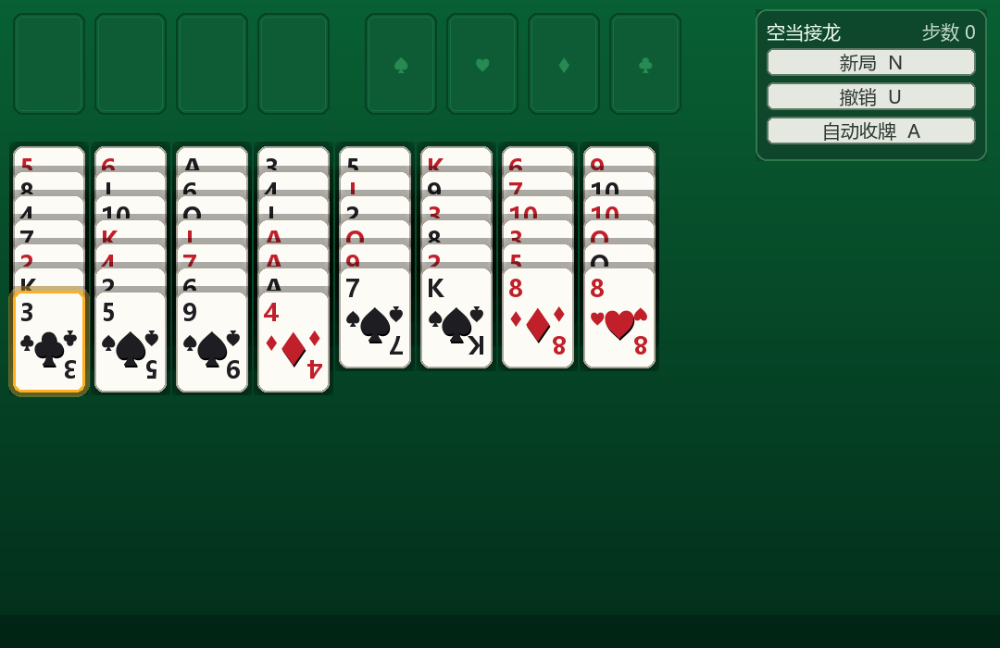
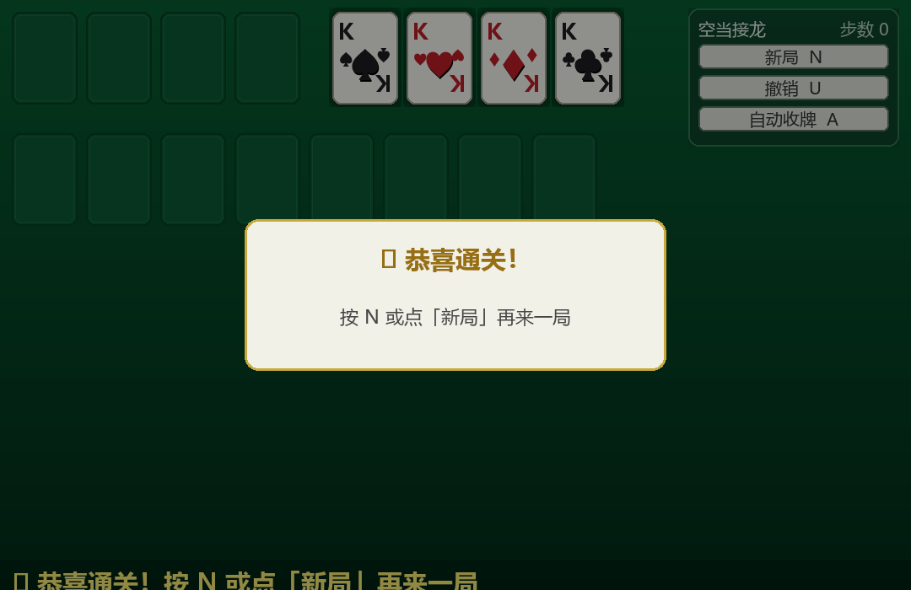

#  空当接龙 FreeCell

一个本地运行的经典纸牌游戏，使用 **Python + pygame** 实现，支持 **Windows 10 / Windows 11**。

完整实现空当接龙规则：8 个主列、4 个自由单元格、4 个回收位，支持整组移动（受「空自由格 + 空列」数量限制）、撤销、自动收牌、胜利/死局检测。




##  功能特性

 **完整规则**：标准 52 张发牌（4×7 + 4×6）、红黑交替降序叠牌、回收位按花色 A→K 升序
 **整组移动**：一次可移动牌数 = (空自由单元格数 + 1) × 2^空列数，自动按规则限制可选牌组
 **灵活的移动方式**：点击选择再点击落位，或按住直接拖拽
 **双击快速收牌**：双击列顶/格顶牌，可收则自动放入回收位
 **撤销 / 新局 / 自动收牌**：按钮与快捷键双支持（`U` / `N` / `A`）
 **智能提示**：死局检测（"没有可移动的牌了"）与胜利弹窗
 **精美美术**：渐变背景、经典扑克牌面（Segoe UI Symbol 花色 + 中央大花色 + 角标投影）、凹陷空槽、选中金色发光、右上角工具面板（标题 + 实时步数）、胜利动画弹窗
 **性能优化**：52 张牌面与背景、投影全部预渲染缓存，每帧仅 blit

##  安装与运行

### 环境要求

 Windows 10 / 11
 Python 3.10+（已在 3.14 验证）
 依赖：`pygame-ce`（社区版，提供新版 Python 的预编译包；官方 `pygame` 在较新 Python 上可能无法安装）

### 安装

```powershell
cd freecell
python -m pip install -r requirements.txt
```

> 注意：依赖安装的是 `pygame-ce` 而非官方 `pygame`——两者 API 完全兼容，代码中 `import pygame` 不变。

### 运行

```powershell
python main.py
```

##  操作说明

| 操作 | 方式 |
| --- | --- |
| 移动牌 | 左键点选一组牌（金色高亮）后，再点目标位置；或按住左键直接拖到目标 |
| 快速收牌 | 双击一张牌：能收进回收位则自动放入 |
| 取消选择 | 右键 / `Esc` / 点击空白处 |
| 撤销 | 「撤销」按钮或 `U` |
| 新局 | 「新局」按钮或 `N` |
| 自动收牌 | 「自动收牌」按钮或 `A`（把当前能直接回收的牌全部收走） |

界面右上角工具面板：**新局 N / 撤销 U / 自动收牌 A** + 实时步数；底部状态栏显示操作提示、死局与胜利信息。

##  规则

 8 个主列，每列一叠牌全部面朝上；开局 4 列 7 张、4 列 6 张
 4 个自由单元格（左上）：每格最多放 1 张牌
 4 个回收位（右上）：每种花色从 A 到 K 升序收牌
 主列移动：目标列顶牌须与移动牌组最底牌**颜色相反、点数小 1**
 一次可移动的牌数 = (空自由单元格数 + 1) × 2^空列数
 目标：把全部 52 张牌按花色收进回收位即获胜

##  测试

```powershell
cd freecell
python -m unittest discover -v
```

共 **30 个测试用例**，覆盖：

 发牌布局（52 张、4×7+4×6、无重复）
 回收位顺序、列间红黑交替规则、自由格单张限制
 可移动数量公式、整组/部分移动（`move(n=...)`）、撤销对称性
 自动收牌与可撤销性、回收位拖出、死局/胜利判定
 随机 300 步对局状态不变量、随机 200 步 undo 严格对称
 UI 交互（点选截取、双击收牌、拖拽只移选中部分）

##  技术细节

 **规则与界面分离**：`game.py` 为纯逻辑模块，不依赖 pygame，便于测试与复用
 **字体**：花色符号使用 Windows 自带 Segoe UI Symbol（字形精致），中文使用微软雅黑，均按路径直接加载以绕开 pygame 字体枚举的兼容性问题
 **兼容性说明**：pygame-ce 2.5.7 为 Python 3.14 提供预编译 wheel；若使用官方 pygame，请用 Python ≤3.12

##  License

MIT License — 自由使用、修改与分发。
